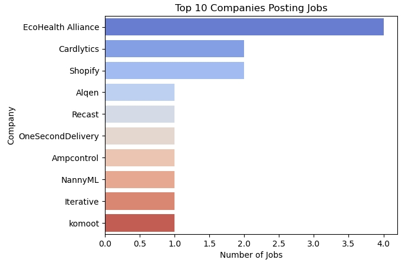

Scrape-and-analyze-data-analyst-job-requirements-with-Python
Automated Job Scraping with Python – A data analysis project that scrapes job listings from RemoteOK (example) to help a recruitment agency improve vacancy sourcing through automation and insights.

🚀 Automated Job Scraping & Analysis with Python
A Python-based project that scrapes job postings from RemoteOK to improve sourcing efficiency and deliver actionable hiring insights to clients.

🔧 Tools & Technologies
Python (Jupyter Notebook)

BeautifulSoup & Requests

Pandas

Matplotlib & Seaborn

📊 Project Goals
Automate job data collection

Clean and structure job listings

Visualize hiring trends (e.g., top companies, job locations)

📁 Files Included
job_scraper.ipynb – Notebook for scraping and analysis

data/job_data.csv – Final cleaned dataset

Visualization.jpg – Sample chart from analysis

requirements.txt – Installable package list

📈 Sample Output

📌 Next Steps
Automate weekly scraping

Expand to other job boards

Create interactive dashboards in Looker Studio

🧑‍💼 Author
Istiak Alam

